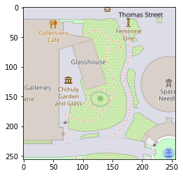
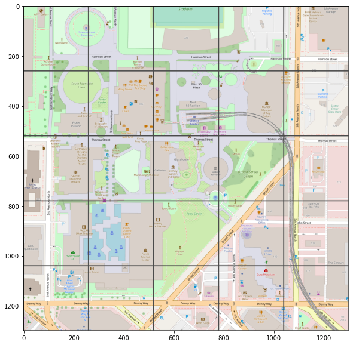

# Map Tiles to Georeferenced PDF

### Using OpenStreetMap for the tiles and OpenCV and GDAL for raster processing

#### This notebook shows how to take a coordinate, get the surrounding map tiles and create a georeferenced PDF from the tile images

##### Step 1 - Transform state plane coordinates to WGS84 Lat/Lon degrees (skip if you already have Lat/Lon degree values)
##### Step 2 - Get the closest map tile number from the coordinates given a certain zoom level
##### Step 3 - Create a range of X and Y tile numbers to surround the target tile with extra tiles
##### Step 4 - Get the tile PNG images from OpenStreetMap and convert them to OpenCV images (numpy arrays)
##### Step 5 - Using OpenCV, concatenate the tile arrays into a master image
##### Step 6 - Get GDAL Ground Control Points from each tile's northwest corner coordinates, and the tile's norwest corner array indices
##### Step 7 - Write the master image array to a GDAL Raster Dataset
##### Step 8 - Project that dataset to WGS84 and add the Ground Control Points
##### Step 9 - Warp the dataset using GDAL to finalize georeferencing
##### Step 10 - Copy the warped dataset to a georeferenced PDF


## Imports and Constants

#### Installing GDAL can be somewhat tricky, this is the process I used...

For this demonstration we are using Python 3.10 on a 64-bit machine
If you are also using Python 3.10 on a 64 bit machine you can pip install the provided wheel for GDAL
in this repository

```bash
    pip install GDAL-3.4.2-cp310-cp310-win_amd64.whl
```

If you are using a different version of Python or a 32 bit machine, download the GDAL wheel corresponding
to your Python version number and bit size from this repository: https://www.lfd.uci.edu/~gohlke/pythonlibs/

The Python version corresponds to the cpXXX number in the wheel filename. For 32 bit the end of the filename
will be win32 and for 64 bit it will be win_amd64.

For example:

Python 3.8 32-bit = GDAL-3.4.2-cp38-cp38-win32.whl

Python 3.8 64-bit = GDAL-3.4.2-cp38-cp38-win_amd64.whl

```bash
    pip install <GDAL filename>
```


```python
import cv2
import json
import math
import numpy as np
import os
import pyproj
import requests
from matplotlib import pyplot as plt
from osgeo import gdal, ogr, osr

WA_SOUTH_EPSG = 'EPSG:2927'
WGS84_EPSG = 'EPSG:4326' # This is the projection system for Mercator and Map Tiles
```


## Step 1 - Tranform the state plane coordinates to WGS84 Lat/Lon Degrees

#### This X/Y is in State Plane Feet for the Space Needle in Seattle


```python
XY_SEATTLE = (1_184_355.269, 839_450.242)
```

#### Transform the state plane coordinates to WGS84 lat/lon


```python
# First transform the XY coordinate to LAT/LONG using pyproj (Proj4)
# Create Transformer object from crs (coordinate reference systems)
# Argument 1 is the coordinate system to be inputed
# Argument 2 is the coordinate system to be transformed into

transformer = pyproj.Transformer.from_crs(WA_SOUTH_EPSG, WGS84_EPSG)
lat, lon = transformer.transform(*XY_SEATTLE)
lat, lon
```


    (47.62047833051376, -122.34925913830723)


## Step 2 - Get the closest map tile number for the coordinates

#### This algorithm comes from Open Street Map https://wiki.openstreetmap.org/wiki/Slippy_map_tilenames


```python
# Use the algorithm from OpenStreetMap to convert Lat/Long to closest Map Tile at a given zoom level
# For this example we will use Zoom Level 18

zoom_level = 18
n = 2 ** zoom_level

# Convert Lat from degrees to radians
lat_rad = math.radians(lat)

# Get X tile number from Longitude Degrees
xtile = int((lon + 180.0) / 360.0 * n)

# Get Y tile number from Latitude Radians
ytile = int((1.0 - math.asinh(math.tan(lat_rad)) / math.pi) / 2.0 * n)
print('Without TMS (X,Y) -\t', (xtile, ytile))

# If using Tile Map Serivces (TMS) style of tiling, the Y tile number needs to be corrected for TMS
ytile_TMS = n - ytile - 1
print('With TMS (X,Y) -\t', (xtile, ytile_TMS))
```

    Without TMS (X,Y) -	 (41979, 91536)
    With TMS (X,Y) -	 (41979, 170607)
    

#### Get closest map tile from OpenStreetMap


```python
# This is the base url for OpenStreetMap tiles
# Format the url string with Zoom Level, X tile number and Y tile number to get the tile
base_url = 'https://tile.openstreetmap.org/{zoom}/{x}/{y}.png'

# Request the tile usings requests
req = requests.get(base_url.format(zoom=zoom_level, x=xtile, y=ytile))

# Write req.content to a temp file on disk, the content will be in bytes so enable 'wb' in open(...)
tempfile = f'temp_tile_{zoom_level}_{xtile}_{ytile}.png'

with open(tempfile, 'wb') as f:
    f.write(req.content)

# Read the temp file to a numpy array using OpenCV
image = cv2.imread(tempfile)

# Now that it is a numpy array, delete the temp file
os.remove(tempfile)

# Show tile image in RGB
plt.imshow(cv2.cvtColor(image, cv2.COLOR_BGR2RGB))
```


    <matplotlib.image.AxesImage at 0x2b6059e87f0>


    

    


## Step 3 - Create a range of X and Y tile numbers to surround the target tile with extra tiles

#### Get multiple map tiles around the target tile 


```python
# Using an offset number of tiles, we can get a range of X and Y tile numbers surrounding the target tile
offset = 2
xtile_rng = range(xtile - offset, xtile + offset + 1)
ytile_rng = range(ytile - offset, ytile + offset + 1)
```

## Step 4 - Get the tile PNG images from OpenStreetMap and convert them to OpenCV images (numpy arrays)

## Step 5 - Using OpenCV, concatenate the tile arrays into a master image


```python
# Using a for-loop we can get the numpy arrays of the map tile images as we did above
# Then using OpenCV we can concatenate the images into a master image
horizontal_concat = []
for x in xtile_rng:
    vertical_concat = []
    for y in ytile_rng:
        # Requesting and writing the image as above
        req = requests.get(base_url.format(zoom=zoom_level, x=x, y=y))
        tempfile = f'temp_tile_{zoom_level}_{x}_{y}.png'
        with open(tempfile, 'wb') as f:
            f.write(req.content)
        image = cv2.imread(tempfile)
        os.remove(tempfile)
        
        # Adding a border to each image to see the individual tiles in the master image
        image = cv2.copyMakeBorder(image, 2, 2, 2, 2, cv2.BORDER_CONSTANT, value=(75, 75, 75))
        
        # Adding the image (numpy array) to the vertical_concat list
        vertical_concat.append(image)
    
    # Vertically concatenating the arrays in the vertical_concat list and adding that concatenated image array to the
    # horizontal_concat list
    vertical_image = cv2.vconcat(vertical_concat)
    horizontal_concat.append(vertical_image)

# Horizontally concatenating the vertical images to create the master image array
master_image = cv2.hconcat(horizontal_concat)

# Make matplotlib chart bigger 
plt.rcParams['figure.figsize'] = [10, 10]

# Show master tile image in RGB
plt.imshow(cv2.cvtColor(master_image, cv2.COLOR_BGR2RGB))
```


    <matplotlib.image.AxesImage at 0x2b605add900>


    

    


## Step 6 - Get GDAL Ground Control Points from each tile's northwest corner coordinates, and the tile's norwest corner array indices

#### Getting Ground Control Points
Using the map tile number we can convert to Lat/Lon of the Northwest (upper-left) Corner of each tile

This algorithm also comes from OpenStreetMap https://wiki.openstreetmap.org/wiki/Slippy_map_tilenames


```python
min_xtile = min(xtile_rng)
min_ytile = min(ytile_rng)

ground_control_pts = []
for x in xtile_rng:
    for y in ytile_rng:
        # Convert tile numbers to lat/lon
        lon = x / n * 360.0 - 180.0  # degrees
        lat_rad = math.atan(math.sinh(math.pi * (1 - 2 * y / n)))  # radians
        lat = math.degrees(lat_rad)  # degrees
        
        # Using the min tile numbers and current tile numbers to get the pixel index of the master image array
        # Each tile is 256 x 256 pixels
        xtile_idx = float((x - min_xtile) * 256)
        ytile_idx = float((y - min_ytile) * 256)
        
        # Using GDAL to create ground control points and adding them to the ground_control_pts list
        # gdal.GCP takes 5 arguments: longitude, latitude, z-value, x-value, y-value
        gcp = gdal.GCP(lon, lat, 0.0, xtile_idx, ytile_idx)
        ground_control_pts.append(gcp)
        
ground_control_pts       
```


    [<osgeo.gdal.GCP; proxy of <Swig Object of type 'GDAL_GCP *' at 0x000002B6065E14D0> >,
     <osgeo.gdal.GCP; proxy of <Swig Object of type 'GDAL_GCP *' at 0x000002B6065E3600> >,
     <osgeo.gdal.GCP; proxy of <Swig Object of type 'GDAL_GCP *' at 0x000002B6065E3E70> >,
     <osgeo.gdal.GCP; proxy of <Swig Object of type 'GDAL_GCP *' at 0x000002B6065E3780> >,
     <osgeo.gdal.GCP; proxy of <Swig Object of type 'GDAL_GCP *' at 0x000002B6065E36C0> >,
     <osgeo.gdal.GCP; proxy of <Swig Object of type 'GDAL_GCP *' at 0x000002B606604030> >,
     <osgeo.gdal.GCP; proxy of <Swig Object of type 'GDAL_GCP *' at 0x000002B606606190> >,
     <osgeo.gdal.GCP; proxy of <Swig Object of type 'GDAL_GCP *' at 0x000002B606606100> >,
     <osgeo.gdal.GCP; proxy of <Swig Object of type 'GDAL_GCP *' at 0x000002B606606070> >,
     <osgeo.gdal.GCP; proxy of <Swig Object of type 'GDAL_GCP *' at 0x000002B606605FE0> >,
     <osgeo.gdal.GCP; proxy of <Swig Object of type 'GDAL_GCP *' at 0x000002B606605F50> >,
     <osgeo.gdal.GCP; proxy of <Swig Object of type 'GDAL_GCP *' at 0x000002B606605EC0> >,
     <osgeo.gdal.GCP; proxy of <Swig Object of type 'GDAL_GCP *' at 0x000002B606605E30> >,
     <osgeo.gdal.GCP; proxy of <Swig Object of type 'GDAL_GCP *' at 0x000002B606605DA0> >,
     <osgeo.gdal.GCP; proxy of <Swig Object of type 'GDAL_GCP *' at 0x000002B606604690> >,
     <osgeo.gdal.GCP; proxy of <Swig Object of type 'GDAL_GCP *' at 0x000002B606604720> >,
     <osgeo.gdal.GCP; proxy of <Swig Object of type 'GDAL_GCP *' at 0x000002B6066047B0> >,
     <osgeo.gdal.GCP; proxy of <Swig Object of type 'GDAL_GCP *' at 0x000002B606604840> >,
     <osgeo.gdal.GCP; proxy of <Swig Object of type 'GDAL_GCP *' at 0x000002B6066048D0> >,
     <osgeo.gdal.GCP; proxy of <Swig Object of type 'GDAL_GCP *' at 0x000002B606604960> >,
     <osgeo.gdal.GCP; proxy of <Swig Object of type 'GDAL_GCP *' at 0x000002B6066049F0> >,
     <osgeo.gdal.GCP; proxy of <Swig Object of type 'GDAL_GCP *' at 0x000002B606604A80> >,
     <osgeo.gdal.GCP; proxy of <Swig Object of type 'GDAL_GCP *' at 0x000002B606604B10> >,
     <osgeo.gdal.GCP; proxy of <Swig Object of type 'GDAL_GCP *' at 0x000002B606604BA0> >,
     <osgeo.gdal.GCP; proxy of <Swig Object of type 'GDAL_GCP *' at 0x000002B606604C30> >]


## Step 7 - Write the master image array to a GDAL Raster Dataset

## Step 8 - Project that dataset to WGS84 and add the Ground Control Points

## Step 9 - Warp the dataset using GDAL to finalize georeferencing

## Step 10 - Copy the warped dataset to a georeferenced PDF


```python
# gdal.Driver.Create creates a raster datatset and needs these 4 arguments: 
# filename (empty string for in-memory rasters), raster width, raster height, number of bands
dataset = gdal.GetDriverByName('MEM').Create('', master_image.shape[1], master_image.shape[0], master_image.shape[2])

# Writing the master image array to the raster object
# When using a numpy array the interleave needs to be 'pixel'
# If using a numpy array from OpenCV, the bands list needs to be reversed because OpenCV is BGR (blue-green-red)
# instead of normal RGB (red-green-blue)
# Or conversely you can convert the master image to RGB using OpenCV and have the bands list in normal order [1, 2, 3] 
dataset.WriteArray(master_image, interleave='pixel', band_list=[3, 2, 1])

# Create a Spatial Reference and import it from the WGS84 EPSG number
srs = osr.SpatialReference()
srs.ImportFromEPSG(int(WGS84_EPSG.split(':')[1]))

# Set the projection and spatial ref for the dataset
dataset.SetProjection(srs.ExportToWkt())
dataset.SetSpatialRef(srs)

# Setting the ground control points for the dataset
dataset.SetGCPs(ground_control_pts , dataset.GetProjection())


# The dataset needs to be "warped" to finish the georeferencing
# Setting the warp options
warp_options = gdal.WarpOptions(
    format='MEM', 
    width=master_image.shape[1], 
    height=master_image.shape[0], 
    srcSRS=WGS84_EPSG, 
    dstSRS=WGS84_EPSG
)
# Warping the dataset to a new in-memory dataset
warp = gdal.Warp('', dataset, options=warp_options)

# Set the driver to "PDF" for georeferenced PDFs or "GTiff" for GeoTIFF
filename = 'seattle_georeferenced.pdf'   # OR 'seattle_georeferenced.tiff'
driver = gdal.GetDriverByName('PDF')  # OR gdal.GetDriverByName('GTiff')

# Create a copy of the warped dataset which will write the new file to disk
driver.CreateCopy(filename, warp, 1)

# Need to "let-go" of the datasets to be able to write to disk
dataset = None
warp = None
```

#### You now have a georeferenced PDF or TIFF from using state plane coordinates
